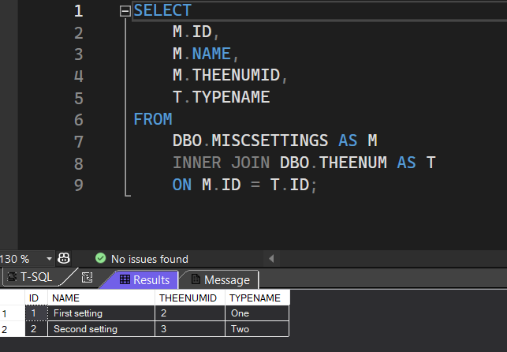

# ASP.NET Core startup validation


Learn the basics for validation on startup of a ASP.NET Core/Razor Pages for strongly typed configuration objects and a quirk when dealing with enumerations.

> **Note**
> Although the focus overall is validating values in appsettings.json, the main reason stems from a quirk with reading enum values as presented in example 3.


The main approach is with [ValidateOnStart](https://learn.microsoft.com/en-us/dotnet/api/microsoft.extensions.dependencyinjection.optionsbuilderextensions.validateonstart?view=dotnet-plat-ext-8.0) which enforces options validation check on start rather than in runtime.

| Project        |   Description
|:------------- |:-------------|
| EF_StringEncryptPropertyValues | Main project for demonstrating validating in Program.cs
| EnumLibrary | For T4 template |
| MiscSettingsApp | For generating json for EF_StringEncryptPropertyValues |

## Example 1

Simple example, in appsettings.json, the DefaultConnection server needs to be set to .\SQLEXPRESS and if not when starting the application or running inside Visual Studio should throw an exception rather than when a database connection is needed. In the following settings done with a property ActiveEnvironment needs to see if it is set also.

```json
"ConnectionsConfiguration": {
  "ActiveEnvironment": "Development",
  "Development": "Data Source=.\\SQLEXPRESS;Initial Catalog=EF.CreatePopulate;Integrated Security=True;Encrypt=False",
  "Stage": "Stage connection string goes here",
  "Production": "Prod connection string goes here"
}
```

First step is to create a class to perform validation.

```csharp
public class ConnectionHelpers
{
    public static bool CheckConnectionString(ConnectionsConfiguration connections)
    {
        SqlConnectionStringBuilder sqlConnectionStringBuilder = new(connections.Development);
        if (sqlConnectionStringBuilder.DataSource != ".\\SQLEXPRESS")
        {
            return false;
        }

        if (!Equals(sqlConnectionStringBuilder.Encrypt, SqlConnectionEncryptOption.Optional))
        {
            return false;
        }

        // ensure the active environment is set
        if (string.IsNullOrEmpty(connections.ActiveEnvironment))
        {
            return false;
        }

        // do we have a proper environment
        if (!Enum.TryParse(connections.ActiveEnvironment, out ConnectionEnvironment _))
        {
            return false;
        }

        return true;
    }
}
```

The next step is to add the validation to the startup class, Program.cs, Main method.

1. AddOptions is for the model ConnectionsConfiguration (see below).
1. Validate(ConnectionHelpers.CheckConnectionString... uses the method above logic to determine if the configuration is valid for the database connection.


```csharp
public class ConnectionsConfiguration
{
    [Required]
    public string ActiveEnvironment { get; set; }
    public string Development { get; set; }
    public string Stage { get; set; }
    public string Production { get; set; }
}
```

## Example 2

Given the following in appsettings.json, its possible that there was a mistyped value or empty value.

```json
"AzureSettings": {
  "UseAdal": false,
  "Tenant": "b2ctest.onmicrosoft.com",
  "TenantName": "b2ctest",
  "TenantId": "cede2199-a2d8-4ccb-875d-8a77ec13bcd4",
  "Audience": "https://oregon.onmicrosoft.com/iisexpress/services/aced",
  "ClientId": "161e59c7-97ce-4e56-84bf-b9568bc3ff4b",
  "GraphClientId": "161e59c7-88ce-4e63-84bf-b9568bc3ff4b",
  "GraphClientSecret": "BU4yO0HAEHTNKaDlUASK0onq0IP9yDH5CUrvUxzyxf4=",
  "SignUpSignInPolicyId": "B2C_1_SignupOrSignin",
  "AzureGraphVersion": "api-version=1.6",
  "MicrosoftGraphVersion": "1.0",
  "AadInstance": "https://login.microsoftonline.com/{0}/v2.0/.well-known/openid-configuration?p={1}"
}
```

Below is a simplied version to perform partial validation, showing all validation would be lengthy and adds no real value here.

Method in Program.cs

```csharp
private static void ValidateAzureSettings(WebApplicationBuilder builder)
{
    builder.Services.AddOptions<AzureSettings>()
        .BindConfiguration(nameof(AzureSettings))
        .ValidateDataAnnotations()
        .Validate(audience
            => !string.IsNullOrWhiteSpace(audience.Audience), "Audience is required")
        .Validate(audience
            => audience.UseAdal == false, "UseAdal must be false")
        .ValidateOnStart();
}
```

Called in Program.cs, Main method.

```csharp
public class Program
{
    public static void Main(string[] args)
    {
        var builder = WebApplication.CreateBuilder(args);
        ValidateAzureSettings(builder);
        . . .
```

## Example 3

The following is a quirk when dealing with enumerations which was taken from the following Stackoverflow [question](https://stackoverflow.com/questions/77517833/invalid-enum-value-in-a-list-doesnt-get-caught-in-net-configuration-but-get-it).

For this example, there are two approaches. The first is using ValidateOnStart and the second method will use code to create the enum using a T4 template to generate the settings which can be dropped into appsettings.json and can use ValidateOnStart as a secondary check.

**IPORTANT**

When running the code, validation is setup to fail. because for the first element under MiscSettings TheEnum value is One1 while valid values are One, Two and Three where TheEnum is generated via a T4 template in EnumLibrary class project.

```json
"MiscSettings": [
  {
    "Name": "Invalid",
    "TheEnum": "One1"
  },
  {
    "Name": "Valid",
    "TheEnum": "Two"
  }
]
```

**Issue**

Given the following section in appsettings.json

```json
"MiscSettings": [
  {
    "Name": "Valid",
    "TheEnum": "One"
  },
  {
    "Name": "Valid",
    "TheEnum": "Two"
  }
]
```

And the model taken from the question.

```csharp
public class MiscSettings : IEnumerable
{
    public string Name { get; set; }
    public TheEnum TheEnum { get; set; }
    public IEnumerator GetEnumerator()
    {
        throw new NotImplementedException();
    }
}
```

Along with the enum.

```csharp
public enum TheEnum
{
    One,
    Two,
    Three
}
```

When displaying in a select we get expected results.


Setup in Main method of Program.cs

```csharp
builder.Services.Configure<MiscSettings>(nameof(MiscSettings),
    builder.Configuration.GetSection(nameof(MiscSettings)));
```

Then in the index page

```csharp
public class IndexModel : PageModel
{
    public List<SelectListItem> Options { get; set; }
   
    [BindProperty]
    public string SelectedItem { get; set; }
    public readonly IOptions<List<MiscSettings>> MiscSettingsList;
    public IndexModel(IOptions<List<MiscSettings>> options)
    {
        MiscSettingsList = options;

        Options = MiscSettingsList.Value.Select(item => new SelectListItem()
        {
            Value = item.TheEnum.ToString(),
            Text = item.Name
        }).ToList();
    }
}
```

### Approach 1

Suppose a developer mistyped the value in appsettings.json and set the value to "Onee" instead of "One". When the application is runs an exception is thrown in the constructor above.

A smart developer will use ValidateOnStart yet this will not catch the error as in this case internal code reports one MiscSetting, not two, so we still will get a runtime exception in index constructor.

Knowing this we can get a count for items in the section then compare to the count of the enum. The section count will be two in this case and the internal from .Validate will report one.

With that we can validate as shown below.

```csharp
builder.Services.AddOptions<List<MiscSettings>>()
    .BindConfiguration(nameof(MiscSettings))
    .Validate(settings =>
    {
        var itemCount = ConfigurationRoot()
            .GetSection(nameof(MiscSettings))
            .GetChildren().Count();
        return settings.Count == itemCount;
    }, $"Invalid count of {nameof(MiscSettings)}")
    .ValidateOnStart();
```

### Approach 2

Create a separate application to create the section for appsettings.json which can be pasted into appsettings.json so that there is no mistyping of Enum values and optionally use ValidateOnStart.

**Step 1**

Extract the models MiscSettings and TheEnum from the web project and place them into a class project.


**Step 2**

Create a SQL-Server database as follows which will be used to store data which in turn will be converted to Json.


Populated with data



Using Dapper, read in the data as per below.

```csharp
internal class Operations
{
    /// <summary>
    /// Read data from MiscSettings table joined with TheEnum
    /// </summary>
    /// <returns></returns>
    public static async Task<List<MiscSettings>> ReadMiscSettings()
    {
        await using SqlConnection cn = new(ConnectionString());
        return cn.Query<MiscSettings>(SqlStatements.SelectMiscSettings).AsList();
    }
}
```

From the list read using Dapper, create a json string, display on the screen and write to a .json file. Either copy and paste from the screen or from the json file into appsettings.json in the web project.

```csharp
internal partial class Program
{
    static async Task Main(string[] args)
    {
        var list = await Operations.ReadMiscSettings();
        list.ToJson("data");

        MiscSettingsRoot root = new() { MiscSettings = list.ToArray()};
        var json = JsonSerializer.Serialize(root, new JsonSerializerOptions
        {
            WriteIndented = true
        });

        PresentJson(json);

        Console.WriteLine();
        Console.WriteLine();
        json.ToJson("FinalResults");
        AnsiConsole.MarkupLine("[yellow]Done[/]");
        Console.ReadLine();
    }
}
```

---

Screenshot


### Notes

There are two versions of MiscSettings, the first for the web project and the second for reading data from the database. I did this rather fast and in hindsight could had done a better job and had one model.


For web

```csharp
public class MiscSettings
{
    
    public string Name { get; set; }
    public TheEnum TheEnum { get; set; }
    public override string ToString() => Name;
}
```

For creating json

```csharp
public class MiscSettings
{
    [JsonIgnore]
    public int Id { get; set; }
    public string Name { get; set; }
    [JsonPropertyName("TheEnum")]
    public string TypeName { get; set; }

    public override string ToString()
    {
        var options = new JsonSerializerOptions()
        {
            WriteIndented = true,
            PropertyNamingPolicy = JsonNamingPolicy.CamelCase,
            NumberHandling = JsonNumberHandling.WriteAsString,
            DefaultIgnoreCondition = JsonIgnoreCondition.WhenWritingNull,
        };

        return JsonSerializer.Serialize(this, options);
    }

}
```

What is important to glue things together is the [T4 template](https://learn.microsoft.com/en-us/visualstudio/modeling/code-generation-and-t4-text-templates?view=vs-2022) for creating the enum TheEnum. They are not easy to create and Visual Studio does not have colorization for them, I recoomend the following Visual Studio extension [T4 Language for Visual Studio](https://marketplace.visualstudio.com/items?itemName=bricelam.T4Language).

## Summary

The entire point to be made is in 99 percent of the cases where validation is needed before a web project runs ValidateOnStart works while dealing with enumerations Visual Studio appears to weed out invalid members and then when there is a need to access them a runtime exception is thrown. With that the code presented there are two methods shown to assist in preventing this issue.

Although a console project was just to generate valid json, no reason this can not be done in any C# type of application.

